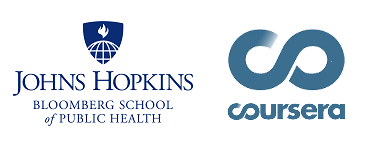

    

# Johns Hopkins University #
# Data Science Specialization - Coursera #

This repository include examples of my work related with the **Data Science Specialization** from [**Johns Hopkins University**](http://www.jhu.edu) thought [**Coursera**](http://www.coursera.org). 

The [Data Science Specialization] (http://www.coursera.org/specializations/jhu-data-science) include nine (9) courses and a final Capstone Project. The courses are taught by professors [Brian Caffo, PhD](http://www.linkedin.com/in/roger-peng-6b39a095), [Jeff Leek, PhD] (http://www.linkedin.com/in/jtleek), and [Roger Peng, PhD] (http://www.linkedin.com/in/roger-peng-6b39a095), of the [Bloomberg School's Department of Biostatistics] (http://www.jhsph.edu/news/news-releases/2014/coursera-specialization.html). 

The program is entirely online; every class includes quizzes, projects and programming. **Each course is four weeks long**, and the final **Capstone Project is seven weeks long**.

I decided to enroll in this Specialization as a **independent an personal goal** with the main objective of build the foundations to enroll in a formal Graduate Course (a Master Program) in the near future.

I **enroll** on **October 2015** and **finish the Capstone Project** on **July 2016**, this is the list of the courses and some examples of my work on it:

1. [**The Data Scientist's Toolbox**] (https://www.coursera.org/course/datascitoolbox): this course provide an introduction to the main tools and ideas in the data scientist's toolbox. The course gives an overview of the data, questions, and tools that data analysts and data scientists work with. There are two components to this course. The first is a conceptual introduction to the ideas behind turning data into actionable knowledge. The second is a practical introduction to the tools that will be used in the program like version control, markdown, git, GitHub, R, and RStudio.

  * Date: October 2015
  * [Certified] (https://www.coursera.org/account/accomplishments/certificate/GUDDUXPCXU)

2. [**R Programming**] (http://www.coursera.org/course/rprog): this course covers practical issues in statistical computing which includes programming in R, reading data into R, accessing R packages, writing R functions, debugging, profiling R code, and organizing and commenting R code. Topics in statistical data analysis will provide working examples.

3. [**Getting and Cleaning Data**] (https://www.coursera.org/learn/data-cleaning): this course cover the basic ways that data can be obtained. The course cover obtaining data from the web, from APIs, from databases and from colleagues in various formats. It also cover the basics of data cleaning and how to make data “tidy”. The course also cover the components of a complete data set including raw data, processing instructions, codebooks, and processed data. The course cover the basics needed for collecting, cleaning, and sharing data.
 
4. [**Exploratory Data Analysis**] (https://www.coursera.org/learn/exploratory-data-analysis): this course covers the essential exploratory techniques for summarizing data. The course cover in detail the plotting systems in R as well as some of the basic principles of constructing data graphics. Also cover some of the common multivariate statistical techniques used to visualize high-dimensional data.
 
5. [**Reproducible Research**] (https://www.coursera.org/learn/reproducible-research): this course focuses on the concepts and tools behind reporting modern data analyses in a reproducible manner. This course focus on literate statistical analysis tools which allow one to publish data analyses in a single document that allows others to easily execute the same analysis to obtain the same results.
 
6. [**Statistical Inference**] (https://www.coursera.org/learn/statistical-inference): this course covers the fundamentals of inference in a practical approach for getting things done. 
 
7. [**Regression Models**] (https://www.coursera.org/learn/regression-models): this course covers regression analysis, least squares and inference using regression models. Special cases of the regression model, ANOVA and ANCOVA was covered as well. Analysis of residuals and variability are investigated. The course cover modern thinking on model selection and novel uses of regression models including scatterplot smoothing.
 
8. [**Practical Machine Learning**] (https://www.coursera.org/learn/practical-machine-learning): this course cover the basic components of building and applying prediction functions with an emphasis on practical applications. The course provide basic grounding in concepts such as training and tests sets, overfitting, and error rates. The course also introduce a range of model based and algorithmic machine learning methods including regression, classification trees, Naive Bayes, and random forests. The course cover the complete process of building prediction functions including data collection, feature creation, algorithms, and evaluation.

9. [**Developing Data Products**] (https://www.coursera.org/learn/data-products): this course covers the basics of creating data products using Shiny, R packages, and interactive graphics. The course focus on the statistical fundamentals of creating a data product that can be used to tell a story about data to a mass audience.

10. [**Data Science Capstone**] (https://www.coursera.org/learn/data-science-project): Natural Language Processing (NLP) Capstone Project offered in collaboration with [SwiftKey] (https://www.swiftkey.com).

